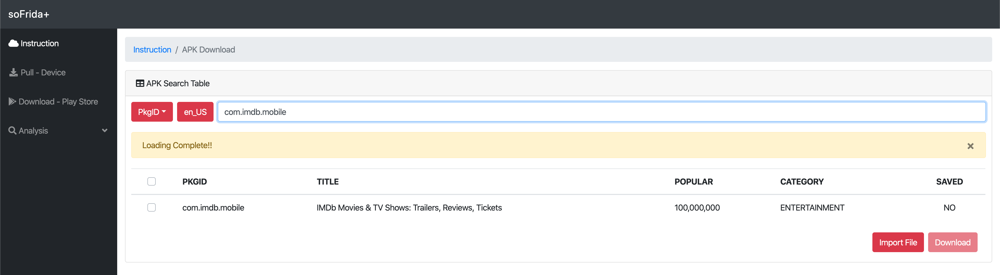
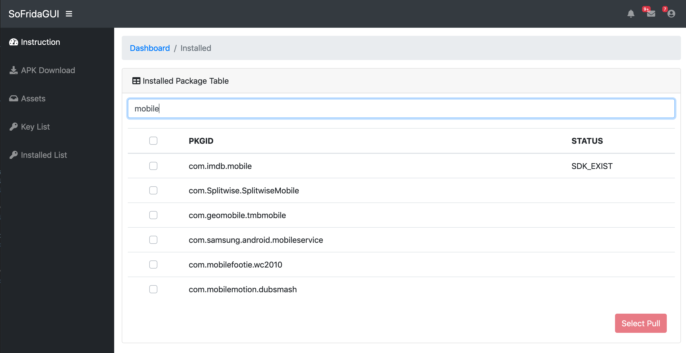
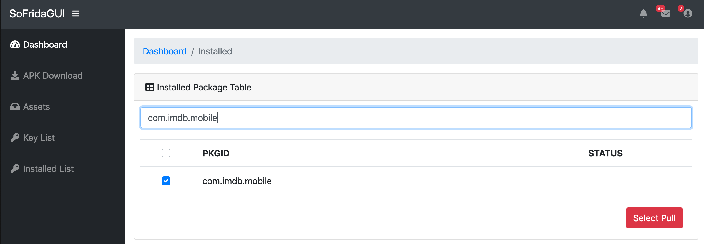
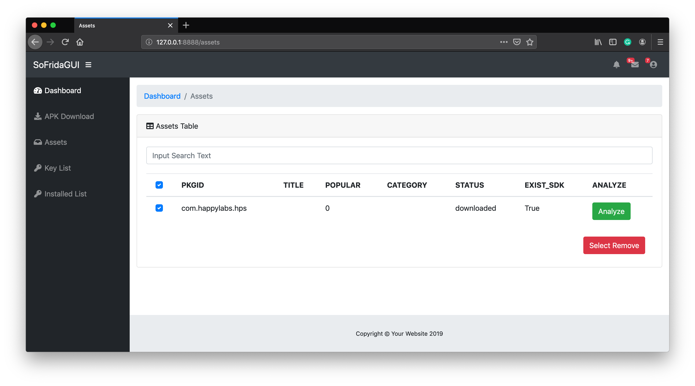
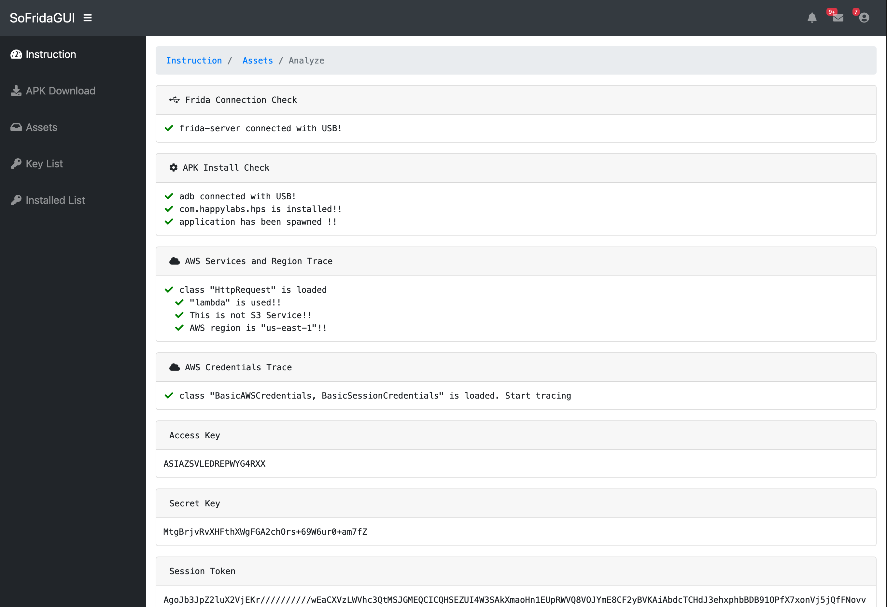
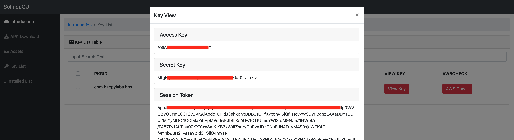

<p align="center">
  
  <p align="center">Dynamic analysis tool that <b>automates</b> finding cloud-backend and vulnerability from mobile applications.<p>
 <p align="center"> With soFrida, you can analyze and detect Cloud API key misconfigurations automatically via dynamic analysis.<P>
<p align="center">This tool willl be released on Defcon 27 Demo Labs.<P>
<p align="center">To see our research, please visit: https://sofrida.github.io<P>


  <p align="center">
    <a href="LICENSE">
      
    </a>
    <a href="https://frida.re">
    	
    </a>
    <a href="https://github.com/SeleniumHQ/selenium">
      
    </a>
    <a href="https://www.python.org/">
    	
    </a>
    <a href="https://socket.io">
    	
    </a>
  </p>
</p>


## Table of Contents
- [How to install and run InstaPy](#installation)
  * [Requirements for Analysis](#requirements)
  * [Installing soFrida](#installation)
  * [Guides and tutorials](#guides) - Available soon.
    * [Video tutorials](#video-tutorials)
- [Main Features](#main-features)
- [Authors](#authors)
- [Disclaimer](#disclaimer)
- [LICENSE](#license)

## Requirements
* Rooted Android mobile phone for hooking process
* Web browser without AD-Block plugins
* [Chrome](https://chromedriver.chromium.org/downloads) or [Firfox](https://github.com/mozilla/geckodriver/releases) driver 
* Support OS : MacOS, Windows, Ubuntu (Tested)
* Only works with higher Python3.6
* Ethical mind 👍

## Installing soFrida
```sudo pip install -r requirements.sf```

That's it. You're ready to hack Cloud-backend 😎

```python3 app.py```

Open your favorite browser and connect to http://127.0.0.1:8888

## Video Tutorials
[](https://youtu.be/l8B3vrJg7zk "Click on to watch tutorials")

## Main Features
- "APK Download" : Download APK Files from Google Play


- "Installed AppList" : Check installed application on mobile phone (Searching available)


- "Installed AppList" : Pull APK Files from mobile phone and check cloud SDK


- "Assets" : You can manage downloaded APKs and Select application for analysis. 
You can identify AWS services and authentication keys


- "Assests" : Result of analysis


- "Key Lists" : You can identify all key lists extracted by analysis.


## Authors
**Hyunjun Park** - Hyunjun Park is a senior engineer of Samsung SDS in South Korea and a graduate student of SANE Lab in Korea University (Supervisor : Seungjoo Gabriel Kim). His daily job is pentesting a broad range of Samsung products including smart phone, smart TV, wearable devices, etc. He also serves as a main staff of Kimchicon Security Conference in South Korea.

**Soyeon Kim** - Soyeon Kim is a security researcher of Samsung SDS in South Korea. She mainly doing a security assessment of Samsung IoT products. She is interested in analyzing Android apps and IOS apps using Frida.

**Seungjoo (Gabriel) Kim** - Seungjoo (Gabriel) Kim is a professor of Graduate School of Information Security at Korea University from 2011. For the past 7 years he was an associate professor of Sungkyunkwan University and have 5 years of back ground of team leader of Cryptographic Technology Team and also IT Security Evaluation Team of KISA(Korea Internet & Security Agency). In addition to being a professor, he is positioning a director of CHAOS(Center for High-Assurance Operating Systems), a head of SANE(Security Analysis aNd Evaluation) Lab, an adviser of hacking club ‘CyKor(two-times champion of DEF CON CTF 2015 & 2018)’ of Korea University, and a founder/advisory director of an international security & hacking conference ‘SECUINSIDE’. 

**Yeongjin Jang** - Yeongjin Jang is an assistant professor of Computer Science at Oregon State University. He hacks CPU, OS, iPhone, IoT devices, and anything that is operated by computers, and wish to make systems secure against the vulnerabilities discovered. He is a two-times champion of DEF CON CTF (DEFKOR and DEFKOR00T). Biography

## Disclaimer
Please Note that this is a research project. We are by no means responsible for any usage of this tool. Use on your own behalf. We're not also not responsible if your accounts get banned due to extensive use of this tool.


## License
This project is licensed under the MIT License - see the [LICENSE](LICENSE) file for details

